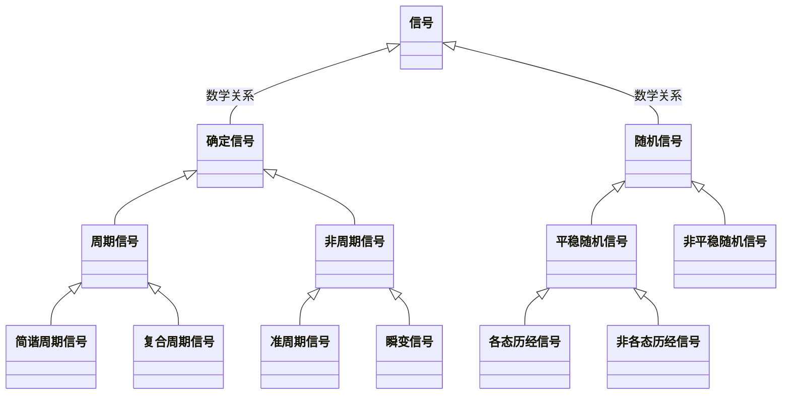

# 信号的描述与分析

## 概述

- 信息

  对对象进行观察，客观存在的事物包含着大量标志其本身所处的时间和空间特征的数据，这就是该事物的“信息”

- 信号

  信息的载体

  比如语音信息表现为声压信号, 视觉信息表现为图像亮度和色彩变换

  > 区分这概念, 可以理解不同的信号背后可以有相同的信息, 同样的信息可以用不同的信号表达

- 信号分为静态信号和动态信号

  - 静态信号

    随时间不变或变化极缓慢的信号，也称为静态量

    例如用直尺测量平板长度，平板长度不随时间变化，是静态信号

  - 动态信号

    随时间变化的测试信号，也称为动态量

### 信号的分类

- 划分方式

  - 数学关系

    - 确定性信号

    - 非确定性信号(又称随机信号)

  - 取值特征

    - 连续信号

    - 离散信号

  - 能量和功率

    - 能量信号

    - 功率信号

  - 时间函数特性和频率函数特性

    - 时限信号

    - 频限信号

  - 取值数域

    - 实信号

    - 复信号

  - 处理分析域

    - 时域信号

    - 频域信号

#### 确定性信号与随机信号

时域特性

- 简谐周期信号简称简谐信号

  $$
  x\left( t\right) =A\sin \left( \omega t+\varphi \right)
  $$

- 复合周期信号

  由若干频率之比为有理数的简谐信号组合而成的信号

  > 有基频(类似公约数)

- 准周期信号

  由不同频率的简谐信号合成, 且各简谐分量的频率之比不全是有理数

  > 没有基频

- 瞬变信号

  具有瞬变性, 持续时间有限, 或随着时间的增加而幅值衰减至零的信号

- 随机信号

  不能准确预测其未来瞬时值

  可采用概率统计的方法描述

  - 样本函数

    随机信号按时间历程所进行的各次长时间观测记录

    记作$x_i(t)$

  - 样本记录

    样本函数在有限时间上的观测记录

  - 随机过程

    在同一实验条件下全部样本函数的集合(总体)

    记作 $\{ x(t) \}$

    即

    $$
    \{ x ( t ) \} = \{ x _ { 1 } ( t ) , x _ { 2 } ( t ) , \cdots , x _ { i } ( t ) , \cdots \}
    $$

    ![][5]

  随机过程的各种平均值(如均值, 方差, 均方值等)时按照集合平均来计算的

  - 集合平均

    t1 时刻

    $$
    \mu _ { x } ( t _ { 1 } ) = \frac { \lim _ { N \rightarrow \infty } \sum _ { i = 1 } ^ { N } x _ { i } ( t _ { 1 } ) } { N }
    $$

  - 时间平均

    单个样本函数的时间历程平均

    $x_1(t)$的时间平均

    $$
    \mu _ { x } = \lim _ { T \rightarrow \infty } \frac { 1 } { T } \int _ { 0 } ^ { T } x _ { 1 } ( t ) d t
    $$

- 平稳随机过程

  其统计特征参数不随时间而变化的随机过程

- 各态历经(遍历)随机过程

  若任一单个样本函数的时间平均统计特征等于该过程的集合平均统计特征

  即

  $$
  \mu _ { x } ( t _ { 1 } ) = \mu _ { x }
  $$

#### 连续信号和离散信号

![][10]

#### 能量信号和功率信号

- 信号的功率

  $$
  x ^ { 2 } ( t )
  $$

- 信号的能量

  $$
  \int x ( t ) ^ { 2 } d t
  $$

- 能量有限信号

  简称能量信号或能限信号

  满足关系:

  $$
  \int _ { - \infty } ^ { \infty } x ^ { 2 } ( t ) d t < \infty
  $$

  瞬变信号属于能量信号

- 平均功率有限信号

  简称功率信号或功限信号

  满足关系:

  - 能量无限

  - 平均功率有限

    在有限区间$(t_1, t_2)$内, 平均功率有限

    即

    $$
    \frac { 1 } { t _ { 2 } - t _ { 1 } } \int _ { t _ { 1 } } ^ { t _ { 2 } } x ^ { 2 } ( t ) d t \lt \infty
    $$

#### 时限信号与频限信号

- 时限信号

  在时域有限区间内有定义, 而在区间外恒等于零

- 频限信号

  在频域内占据一定的带宽, 而其外恒等于零的信号

#### 实信号和复信号

### 信号的描述

- 信号的时域描述

  - 信号的数学描述

    为一个或若干个自变量的函数或序列的形式

  - 信号的波形描述

    波形包含了振幅和频率的信息, 振幅代表了输人量的大小, 频率代表了信号随时间变化的方式

- 信号的频域描述

  将信号的时间域描述转换成对应频域中的某个变量的函数,以此来研究信号的频域特性

  例如, 傅里叶变换, 分解成简谐波, 研究信号的结构和各种频率成分的幅值和相位关系

  ![][14]

- 二者关系

  - 可以相互转换

  - 信息等价

  - 描述方式不同

    取决于不同测试任务的需要

    时域描述直观地反映信号随时间变化的情况

    频域描述则侧重描述信号的结构,即信号所包含的频率分量

### 信号分析中的常用信号

- 简谐信号(正弦信号)
- 单位阶跃信号
- 单位斜坡信号
- 符号函数信号
- 单位脉冲信号
- 矩形窗函数信号

## 信号的时域统计分析

- 重要前提

  随机过程的各种平均值是按集合平均来计算的。

  以下研究的为`各态历经随机过程`, 即集合平均等于时间平均

- 均值

  信号中的常值分量

  $$
  \mu _ { x } = \lim _ { T \rightarrow \infty } \frac { 1 } { T } \int _ { 0 } ^ { T } x ( t ) d t
  $$

- 方差

  波动强度

  $$
  \sigma _ { x } ^ { 2 } = \lim _ { T \rightarrow \infty } \frac { 1 } { T } \int _ { 0 } ^ { T } [ x ( t ) - \mu _ { x } ] ^ { 2 } d t
  $$

  - 方差: $\sigma _ { x } ^ { 2 }$
  - 标准偏差: $\sigma _ { x }$

- 均方值

  信号的强度

  $$
  \psi _ { x } ^ { 2 } = \lim _ { T \rightarrow \infty } \frac { 1 } { T } \int _ { 0 } ^ { T } x ^ { 2 } ( t ) d t
  $$

  - 均方值: $\psi _ { x } ^ { 2 }$
  - 均方根值(常称为有效值): $\psi _ { x }$(正根)

- 关系

  $$
  \sigma _ { x } ^ { 2 } = \psi _ { x } ^ { 2 } - \mu _ { x } ^ { 2 }
  $$

$\sigma _ { x } ^ { 2 }$描述了信号的波动大小, 对应电信号中交流成分的功率

$\mu _ { x } ^ { 2 }$描述了信号的常值分量, 对应电信号中直流成分的功率

$\psi _ { x }$, 对应电流的有效值

- 实际应用

  常常以有限长的样本记录来替代无限长的样本函数

  $$
  \begin{cases}
  \widehat{\mu }_{x}^{2}=\dfrac{1}{T}\int _{0}^{T}x\left( t\right) dt\\
  \widehat{\sigma }_{x}^{2}=\dfrac{1}{T}\int _{0}^{T}\left[ x\left( t\right) -\widehat{\mu }_{x}\right] ^{2}dt\\
  \widehat{\psi }_{x}^{2}=\dfrac{1}{T}\int _{0}^{T}x^{2}\left( t\right) dt
  \end{cases}
  $$

## 信号的相关分析

- 相关

  刻画两个信号(或一个信号不同时刻)取值之间的线性关系或相似程度

  用于随机信号, 也可用于确定性信号

### 相关系数

- 类比

  确定信号的关系用函数来描述

  两个随机变量关系用`相关系数`评价

- 相关系数$\rho_{xy}$

  评价 x 和 y 的线性相关程度

  $$
  \rho _ { x y } = \frac { E [ ( x - \mu _ { x } ) ( y - \mu _ { y } ) ] } { \sigma _ { x } \sigma _ { y } }
  $$

- 相关函数的定义

  描述了随机信号在任意两个不同时刻取值的相关程度

  设$x(t)$是某各态历经随机过程的一个样本记录

  考虑

  $$
  \begin{aligned}
  x &= x(t) \\
  y &= x(t+\tau)
  \end{aligned}
  $$

  代入得

  $$
  \rho _ { x } ( \tau ) = \frac { \lim _ { x \rightarrow \infty } \frac { 1 } { T } \int _ { 0 } ^ { T } [ x ( t ) - \mu _ { x } ] [ x ( t + \tau ) - \mu _ x ] d t } { \sigma _ { x } ^ { 2 } }
  $$

  化简

  $$
  \begin{aligned}
  \rho_{x}(\tau) &=\frac{\lim _{T \rightarrow \infty} \frac{1}{T} \int_{0}^{T} x(t) x(t+\tau) \mathrm{d} t-\mu_{x}^{2}}{\sigma_{x}^{2}} \\
  &=\frac{R_{x}(\tau)-\mu_{x}^{2}}{\sigma_{x}^{2}}
  \end{aligned}
  $$

  定义

  $$
  R_{x}(\tau)=\lim _{T \rightarrow \infty} \frac{1}{T} \int_{0}^{T} x(t) x(t+\tau) \mathrm{d} t
  $$

  深入参考:wiki[自相关函数](https://zh.wikipedia.org/wiki/%E8%87%AA%E7%9B%B8%E5%85%B3%E5%87%BD%E6%95%B0)

- eg

  求$x(t)=A \sin ( \omega t + \varphi )$的自相关函数

  解:

  利用和差化积得:

  $$
  R_{x}(\tau) = \frac { A^2 } { 2 } \cos ( \omega \tau )
  $$

  保留了原信号的幅值和频率信息, 但失去了原信号的相位信息

- 互相关函数

  两信号之间的相关情况或取值依赖关系

  $$
  R_{xy}(\tau)=\lim _{T \rightarrow \infty} \frac{1}{T} \int_{0}^{T} x(t) y(t+\tau) \mathrm{d} t
  $$

  系统的输人和输出信号求互相关函数, 则互相关函数取得最大值时的 $\tau$ 值等于系统的滞后时间

  深入参考:wiki[互相关函数](https://zh.m.wikipedia.org/wiki/%E4%BA%92%E7%9B%B8%E5%85%B3)

- eg

  求$x(t)=A \sin ( \omega t + \theta )$和$y(t)=B \sin ( \omega t + \theta - \varphi )$的互相关函数

  解:

  利用和差化积得:

  $$
  R_{xy}(\tau) = \frac { A B } { 2 } \cos ( \omega \tau - \varphi )
  $$

  两个具有相同频率的周期信号, 其互相关函数中保留了两个信号的频率 $\omega$ 、对应的幅值 A 和 B,以及相位差 $\varphi$ 的信息

深入参考:[自相关与互相关](https://zhuanlan.zhihu.com/p/77072803)

- 相关函数的性质

  

  - 对称性

    $$
    \begin{aligned}
    R_{x}(- \tau) &= R_{x}(\tau) \\
    R_{xy}(- \tau) &= R_{yx}(\tau)
    \end{aligned}
    $$

  - 极大值

    - 自相关函数

      $$
      R _ { x } ( 0 ) = R _ { x } ( \tau ) | _ { \max } = \psi _ { x } ^ { 2 }
      $$

    - 互相关函数

      一般不在$\tau = 0$时取最大值

  - 取值范围

    - 自相关函数

      $$
      \mu _ { x } ^ { 2 } - \sigma _ { x } ^ { 2 } \leq R _ { x } ( \tau ) \leq \mu _ { x } ^ { 2 } + \sigma _ { x } ^ { 2 }
      $$

    - 互相关函数

      $$
      \mu _ { x } \mu _ { y } - \sigma _ { x } \sigma _ { y } \leq R _ { x } ( \tau ) \leq \mu _ { x } \mu _ { y } + \sigma _ { x } \sigma _ { y }
      $$

  - 极限

    当$\tau \rightarrow \infty$时, 随机变量之间不存在内在联系, 彼此无关, 故:

    $$
    R _ { x } ( \tau \rightarrow \infty ) \rightarrow \mu _ { x } ^ { 2 } , \quad R _ { x y } ( \tau \rightarrow \infty ) \rightarrow \mu _ { x } \mu _ { y }
    $$

  - 周期信号

    - 自相关函数是同频率的周期信号，但失去相位信息

    - 同频率的周期信号的互相关函数是同频率的周期信号

      同频相关，不同频不相关

- 能量有限信号的相关函数

  $$
  \begin{aligned}
  R _ { x } ( \tau ) &= \int _ { - \infty } ^ { \infty } x ( t ) x ( t + \tau ) d t  \\
  R _ { x y } ( \tau ) &= \int _ { - \infty } ^ { \infty } x ( t ) y ( t + \tau ) d t
  \end{aligned}
  $$

### 相关函数的工程意义及应用

- 不同类别信号的辨识

  有些信号的类别从其时域波形难以辨别, 但利用自相关函数则容易识别

- 提取周期信号

  在用噪声诊断机器运行状态时, 正常的机器噪声是由大量、无序和大小近似相等的随机成分叠加的结果,因此,自相关函数较快衰减至零

  > 不同时刻基本没有关联, 表现为自相关函数较快衰减至零

  当机器状态异常时,随机噪声的自相关函数将出现规则、周期性的信号, 其幅值比正常噪声的幅值要大

  通过将变速箱中各轴的转速与自相关函数波动的周期相比较,可确定缺陷轴的位置

- 相关测速

  利用互相关函数可以测量物体运动或信号传播的速度和距离

  光电门测速实验中, 两个光电门相距$d$, 物体经过两个光电门, 产生的两个信号$x(t)$和$y(t)$是基本相同的信号, 只是$y(t)$有$\tau$的延时. 当可调延时 $\tau=\tau_d$ 时, 互相关函数取得极大值. 可得 $v=d / \tau_d$

- 相关函数的估计值

  任何观察时间均是有限的, 通常以有限时间 T 的观察值, 即有限长的样本来估计相关函数的真值

  $$
  \begin{cases}
  \widehat R _ { x } ( \tau ) = \frac { 1 } { T } \int _ { 0 } ^ { T } x ( t ) x ( t + \tau ) d t  \\
  \widehat R _ { x y } ( \tau ) = \frac { 1 } { T } \int _ { 0 } ^ { T } x ( t ) y ( t + \tau ) d t
  \end{cases}
  $$

## 信号的频谱

频谱从频率分布的角度出发,研究信号的频率结构及各种频率成分的幅值和相位关系

### 周期信号的频谱

傅里叶级数展开法将一个周期信号表示成简谐(或复指数)信号叠加的形式, 从而获得各叠加分量的频率及相应的幅值与相位信息,即信号的频谱信息

#### 周期信号傅里叶级数的三角级数形式

- 正交函数形式

  $$
  \begin{array}{c}
  x(t)=\frac{a_{0}}{2}+\sum_{n=1}^{\infty}\left(a_{n} \cos n \omega_{0} t+b_{n} \sin n \omega_{0} t\right), n=1,2,3, \cdots \\
  a_{0}=\frac{2}{T} \int_{-T / 2}^{T / 2} x(t) \mathrm{d} t \\
  a_{n}=\frac{2}{T} \int_{-T / 2}^{T / 2} x(t) \cos n \omega_{0} t \mathrm{~d} t \\
  b_{n}=\frac{2}{T} \int_{-T / 2}^{T / 2} x(t) \sin n \omega_{0} t \mathrm{~d} t
  \end{array}
  $$

  $\omega_0$为基波角频率

  $\frac {a_0} {2}$是常值分量,代表了信号在积分区间内的均值

  $a_n$为偶函数:$a_{-n} = a_{n}$

  $b_n$为奇函数:$b_{-n} = -b_{n}$

  > 正是`正交性`, 积分下, $\cos(n \omega) \ast \cos (n \omega) \neq 0$

- 简谐波形式

  $$
  \begin{array}{c}
  x(t)=\frac{a_{0}}{2}+\sum_{n=1}^{\infty}A_{n} \cos n \left( \omega_{0} t+\varphi_{n} \right) \\
  A_{n}=\sqrt{a_{n}^{2}+b_{n}^{2}} \\
  a_{n}=A_{n} \cos \varphi_{n} \\
  b_{n}=- A_{n} \sin \varphi_{n} \\
  \varphi_{n}=- \arctan {\frac {b_n} {a_n}}
  \end{array}
  $$

  满足狄里赫利条件的任何周期信号都可以分解成直流分量及许多简谐分量的叠加,且简谐分量的角频率必定是基波角频率的整数倍

  $\omega_0$为基波

- 图像

  - 信号幅频谱围

  - 相频谱图

  即信号的时域与频域如何从不同的角度来描述同一信号。在时域看到的是信号幅值随时间变化的波形, 而从频域观测到的是一根根谱线, 说明时域信号是由无穷多的谐波分量叠加而成的

- 几何解释

  

  - 代码 [Fourier series visualisation with d3.js](https://bl.ocks.org/jinroh/7524988)

  > 直观地看到是频率的叠加

- 深入参考:[傅里叶级数](https://zh.m.wikipedia.org/wiki/%E5%82%85%E9%87%8C%E5%8F%B6%E7%BA%A7%E6%95%B0)
- 欣赏:[傅里叶视频](https://www.youtube.com/c/3blue1brown/search?query=Fourier)

#### 周期信号傅里叶级数复指数形式

- 正交形式

  $$
  \begin{array}{c}
  x ( t ) = \sum _ { n = - \infty } ^ { \infty } X ( n \omega _ { 0 } ) e ^ { j n \omega _ { 0 } t } \\
  X ( n \omega _ { 0 } ) = \frac { 1 } { T } \int _ { - T / 2 } ^ { T / 2 } x ( t ) e ^ { - j n \omega _ { 0 } t } d t
  \end{array}
  $$

  注意$X ( n \omega _ { 0 } )$是复数形式

  $$
  X ( n w _ { 0 } ) = | X ( n w _ { 0 } ) | e ^ { j \varphi _ { n } }
  $$

#### 周期信号的频谱

- 不同的描述形式

  - 三角函数 => 单边谱

  - 复指数 => 双边谱

- 形式转化

  - 幅度

    - 复数的幅度为三角的一半 => $|X(\omega)| = \frac {A(\omega)} {2}$

    - 然后作轴对称, 作出负半轴

  - 相角

    - 复数的相角与三角相同

    - 然后中心对称, 作出负半轴

- 特征

  - 离散性

  - 谐波性

    有基频

  - 收敛性

    满足狄里赫利条件的周期信号,其谐波幅值总的趋势是随谐波频率的增大而减小

    故而, 由于周期信号的收敛性, 在工程测量中没有必要取次数过高的谐波分量

### 非周期信号的频谱

- 准周期信号

  离散的

  由于不存在基频, 谱线不是等间隔分布

  准周期信号和周期信号的频谱本质相同

#### 傳里叶变換

- 频谱密度的概念

  $$
  X ( \omega ) = \lim _ { T \rightarrow \infty } \frac { X ( n \omega _ { 0 } ) } { f } = \lim _ { T \rightarrow \infty } X ( n \omega _ { 0 } ) T = \lim _ { T \rightarrow \infty } \int _ { - T / 2 } ^ { T / 2 } x ( t ) e ^ { - j n \omega _ { 0 }  t  } d t
  $$

  由于$T \rightarrow \infty, \omega_0 \rightarrow 0$, 离散频率$n \omega_0$变为连续的频率$\omega$, 则有

  $$
  X ( \omega ) = \int _ { - \infty } ^ { \infty } x ( t ) e ^ { - j \omega t } d t
  $$

  $\frac {|X(\omega) d \omega|} {\pi}$ 相当于非周期信号各分量的振幅, 但 $\frac {|X(\omega) d \omega|} {\pi} \rightarrow 0$, 故用频谱密度代替振幅表示信号的频谱

  $|X(\omega)|$ 为 $x(t)$的幅值谱密度, 简称幅频谱

  $\varphi(\omega)$ 为 $x(t)$的相位谱密度, 简称相频谱

- 谐波形式

  $$
  x ( t ) = \frac { 1 } { \pi } \int _ { 0 } ^ { \infty } | X ( w ) | \cos [ \omega t + \varphi ( w ) ] d \omega
  $$

- 频率形式

  用频率$f$代替角频率$\omega$

  $$
  \begin{aligned}
  X ( f ) &= \int _ { - \infty } ^ { \infty } x ( t ) e ^ { - j 2 \pi f t } d t \\
  x ( t ) &= \int _ { - \infty } ^ { \infty } X ( f ) e ^ { j 2 \pi f t } d f
  \end{aligned}
  $$

  > 形式更为对称, 统一

#### 傅里叶变换的主要性质

|  性质名称  |                   时域                   |                        频域                         |
| :--------: | :--------------------------------------: | :-------------------------------------------------: |
| 奇偶虚实性 |                 实偶函数                 |                      实偶函数                       |
| 奇偶虚实性 |                 实奇函数                 |                      虚奇函数                       |
| 奇偶虚实性 |                 虚偶函数                 |                      虚偶函数                       |
| 奇偶虚实性 |                 虚奇函数                 |                      实奇函数                       |
|    线性    |              $ax(t)+bx(t)$               |               $aX(\omega)+bX(\omega)$               |
|   对称性   |                  $X(t)$                  |                  $2\pi x(-\omega)$                  |
|  尺度变换  |                 $x(kt)$                  | $\frac {1} {\lvert k \rvert} X(\frac {\omega} {k})$ |
|  时移特性  |              $x(t \pm t_0)$              |         $X(\omega) e ^ {\pm j \omega t_0}$          |
|  频移特性  |       $x(t) e^{\mp j \omega_0 t}$        |              $X(\omega \pm \omega_0)$               |
|  微分特性  | $\dfrac{d^{k}x\left( t\right) }{dt^{k}}$ |             $(j \omega)^{k} X(\omega)$              |
|  积分特性  |      $\int_{- \infty}^{t} x(t) dt$       |           $\frac {1}{j \omega} X(\omega)$           |
|  时域卷积  |             $x(t) \ast y(t)$             |                $X(\omega) Y(\omega)$                |
|  频域卷积  |               $x(t) y(t)$                |     $\frac {1} {2 \pi}X(\omega) \ast Y(\omega)$     |

- 深入参考:wiki[傅里叶变换](https://zh.wikipedia.org/wiki/%E5%82%85%E9%87%8C%E5%8F%B6%E5%8F%98%E6%8D%A2)

#### 傅里叶变换的条件

- Dirichlet Conditions(狄利克雷条件)

  - 在一周期内，连续或只有有限个第一类间断点

  - 在一周期内，极大值和极小值的数目应是有限个

  - 在一周期内，信号是绝对可积的

- 深入参考: wiki [狄利克雷定理 (傅里叶级数)](<https://zh.m.wikipedia.org/wiki/%E7%8B%84%E5%88%A9%E5%85%8B%E9%9B%B7%E5%AE%9A%E7%90%86_(%E5%82%85%E9%87%8C%E5%8F%B6%E7%BA%A7%E6%95%B0)>)

- 扩展

  若不满足, 可用脉冲函数与广义函数理论进行傅里叶变换

### 典型信号的频谱

#### 单位脉冲函数

引入$\delta(t)$, 运用广义函数理论, 傅氏变换就可以推广到并不满足绝对可积条件的功率信号范畴

- 定义

  $$
  \delta(t) = \begin{cases} +\infty, & t = 0 \\ 0, & t \ne 0 \end{cases}
  $$

  且

  $$
  \int_{-\infty}^\infty \delta(x) \, dx = 1
  $$

- 图像

  用一个单位长度的有向线段表示$\delta(t)$

- 性质

  - 乘积性

  $$
  x ( t ) \delta ( t - t _ { 0 } ) = x ( t _ { 0 } ) \delta ( t - t _ { 0 } )
  $$

  - 筛选性

    $$
    \int _ { - \infty } ^ { \infty } \delta ( t - t _ { 0 } ) x ( t ) d t = \int _ { - \infty } ^ { \infty } \delta ( t - t _ { 0 } ) x ( t _ { 0 } ) d t = x ( t _ { 0 } )
    $$

  - 卷积

    $$
    \begin{aligned}
    x ( t ) \ast \delta ( t \pm t _ { 0 } )
    &= \int _ { - \infty } ^ { \infty } x ( \tau ) \delta ( t \pm t _ { 0 } - \tau ) d \tau \\
    &= x ( t \pm t _ { 0 } )
    \end{aligned}
    $$

    $x(t)$ 和 $\delta (t)$ 函数的卷积就是在发生脉冲的坐标位置上简单地将$x(t)$重新构图

- $\delta (t)$频谱

  $$
  X ( \omega ) = F [ \delta ( t ) ] = \int _ { - \infty } ^ { \infty } \delta ( t ) e ^ { - j \omega t } d t = e ^ { 0 } = 1
  $$

  时域上的单位脉冲函数具有无限宽广的频谱,而且在所有频段上都是等强度的,称为均匀谱

- 变换对

  |     时域信号$x(t)$     |     傅氏变换      |         频域信号$X(\omega)$          |
  | :--------------------: | :---------------: | :----------------------------------: |
  |      $\delta (t)$      | $\leftrightarrow$ |                 $1$                  |
  |  $\delta (t \pm t_0)$  | $\leftrightarrow$ |        $e^{\pm j \omega t_0}$        |
  |          $1$           | $\leftrightarrow$ |       $2 \pi \delta (\omega)$        |
  | $e^{\pm j \omega_0 t}$ | $\leftrightarrow$ | $2 \pi \delta (\omega \mp \omega_0)$ |

- 深入参考:[狄拉克 δ 函数](https://zh.wikipedia.org/wiki/%E7%8B%84%E6%8B%89%E5%85%8B%CE%B4%E5%87%BD%E6%95%B0)

  > 以下为核心, 整个傅里叶定理是一个特殊的$\delta(t)$函数
  >
  > $$
  > \begin{aligned}
  > f(x)&={\frac {1}{2\pi }}\int _{-\infty }^{\infty }e^{ipx}\left(\int _{-\infty }^{\infty }e^{-ip\alpha }f(\alpha )\ d\alpha \right)\ dp\\&={\frac {1}{2\pi }}\int _{-\infty }^{\infty }\left(\int _{-\infty }^{\infty }e^{ipx}e^{-ip\alpha }\ dp\right)f(\alpha )\ d\alpha =\int _{-\infty }^{\infty }\delta (x-\alpha )f(\alpha )\ d\alpha
  > \end{aligned}
  > $$

#### 正余弦的傅氏变换

$$
\begin{aligned}
\sin \omega _ { 0 } t &\leftrightarrow j \pi [ \delta ( \omega + \omega _ { 0 } ) - \delta ( \omega - \omega _ { 0 } ) ]  \\
\cos \omega _ { 0 } t &\leftrightarrow \pi [ \delta ( \omega + \omega _ { 0 } ) + \delta ( \omega - \omega _ { 0 } ) ]
\end{aligned}
$$

- 对比

  正余弦的傅里叶级数是两条谱线

  正余弦的傅氏变换得到的是两个脉冲

#### 周期单位脉冲序列的傅氏变换

- 周期单位脉冲序列的定义

  $$
  \delta_T ( t ) = \sum _ { n = - \infty } ^ { \infty } \delta ( t - n T )
  $$

- 傅里叶级数形式

  由于是周期函数, 则可以写成傅里叶级数的形式

  $$
  \delta _ { T } ( t ) = \sum _ { k = - \infty } ^ { \infty } X ( k \omega _ { 0 }  ) e ^ { j k \omega_ { 0 } t }
  $$

  根据`正交性`和`区间范围`, 求出$X(k \omega_0)$

  $$
  X ( k w _ { 0 } ) = \frac { 1 } { T } \int _ { - T / 2 } ^ { T / 2 } \delta_T  (t) e^{-j k \omega_0 t} d t = \frac { 1 } { T } \int _ { - T / 2 } ^ { T / 2 } \delta ( t ) e ^ { - j k \omega _ { 0 }  t  } d t = \frac { 1 } { T }
  $$

  即得

  $$
  \delta _ { T } ( t ) = \frac { 1 } { T } \sum _ { k = - \infty } ^ { \infty } e ^ { j k \omega _ { 0 } t }
  $$

- 傅里叶变换

  注意这里的$X(\omega)$和傅里叶级数的$X(k \omega_0)$有联系, 但不同

  $$
  \begin{aligned}
  X ( \omega ) &= \mathscr{F}(\delta_T(t)) = \mathscr{F}(\frac { 1 } { T } \sum _ { k = - \infty } ^ { \infty } e ^ { j k \omega _ { 0 } t })\\
  & =\frac { 2 \pi } { T } \sum _ { n = - \infty } ^ { \infty } \delta ( \omega - k \omega _ { 0 } ) \\
  &= \omega _ { 0 } \sum _ { k = - \infty } ^ { \infty } \delta ( \omega - k \omega _ { 0 } ) , \quad w _ { 0 } = \frac { 2 \pi } { T }
  \end{aligned}
  $$

#### 常用功率信号的傅氏变换

|   时域信号$x(t)$   |                                频域信号$X(\omega)$                                 |
| :----------------: | :--------------------------------------------------------------------------------: |
|   $k \delta(t)$    |                                        $k$                                         |
|        $k$         |                              $2 \pi k \delta(\omega)$                              |
|       $u(t)$       |                    $\pi \delta(\omega) + \frac {1} {j \omega}$                     |
|      $sgn(t)$      |                               $\frac {2} {j \omega}$                               |
|     $\cos(t)$      |  $\pi [ \delta ( \omega + \omega _ { 0 } ) + \delta ( \omega - \omega _ { 0 } )]$  |
|     $\sin(t)$      | $j \pi [ \delta ( \omega + \omega _ { 0 } ) - \delta ( \omega - \omega _ { 0 } )]$ |
| $e^{j \omega_0 t}$ |                        $2 \pi \delta ( \omega - \omega_0 )$                        |
|   $\delta_T(t)$    |                          $\omega_0 \delta_\omega(\omega)$                          |

#### 关于傅里叶级数和傅里叶变换的思考

与周期信号的傅氏变换(包含$\sin (t)$和$\cos (t)$)有关

- 总结性:[傅里叶级数与傅里叶变换](http://incf19.com/yynotes/posts/2020-03-29-%E5%82%85%E9%87%8C%E5%8F%B6%E7%BA%A7%E6%95%B0%E4%B8%8E%E5%82%85%E9%87%8C%E5%8F%B6%E5%8F%98%E6%8D%A2/index.html)

- 玩笑式:[傅里叶分析之掐死教程](https://zhuanlan.zhihu.com/p/19763358)

### 随机信号的频谱

- 类比

  确定的函数关系可以频谱分析, 随机信号没有确定的关系, 则对相关性进行频谱分析

  由于随机信号是时域无限信号, 不具备绝对可积条件,不能直接进行傅里叶变换, 而且随机信号的频率、幅值、相位都是随机的,因此,一般不做幅频谱和相频谱分析,而是用具有统计特征的功率谱密度函数来做谱分析

  功率谱密度函数的谱分析方法适用于确定性信号

#### 功率谱密度函数

- 自功率谱密度函数

  设$x(t)$为一零均值的随机过程,有$R_x(\tau \rightarrow \infty)$

  $$
  S _ { x } ( \omega ) = \int _ { - \infty } ^ { \infty } R _ { x } ( \tau ) e ^ { - j \omega r } d \tau
  $$

  当$\tau = 0$时, 根据定义

  $$
  R _ { x } ( 0 ) = \lim _ { T \rightarrow \infty } \frac { 1 } { T } \int _ { 0 } ^ { T } x ^ { 2 } ( t ) d t = \frac { 1 } { 2 \pi } \int _ { - \infty } ^ { \infty } S _ { x } ( \omega ) d \omega
  $$

  $S_{ x } ( \omega )$曲线和频率轴所包围的面积即为信号的平均功率, $S_{ x } ( \omega )$就是信号的功率密度沿频率轴的分布,故称 $S_{ x } ( \omega )$ 为自功率谱密度函数

  $R_{ x } (\tau)$为实偶函数, 则$S_{ x } ( \omega )$为实偶函数, 故双边谱

  实际中常用单边功率谱进行随机信号的谱分析

  $$
  \begin{cases}
  G _ { x } ( \omega ) = 2 S _ { x } ( \omega ) , &\quad \omega \geq 0  \\
  G _ { x } ( \omega ) = 0 , &\quad \omega \lt 0
  \end{cases}
  $$

- 互功率谱密度函数

  - 信号$x(t)$和$y(t)$的互功率谱密度函数

  $$
  \begin{aligned}
  S _ { x y } ( \omega ) &= \int _ { - \infty } ^ { \infty } R _ { x y } ( \tau ) e ^ { - j \omega \tau } d \tau  \\
  R _ { x y } ( \tau ) &= \frac { 1 } { 2 \pi } \int _ { - \infty } ^ { \infty } S _ { x y } ( \omega ) e ^ { j \omega  \tau} d \omega
  \end{aligned}
  $$

  $S _ { x y } ( \omega )$ 简称为互谱密度函数或互谱

  单边互谱密度函数

  $$
  \begin{cases}
  G _ { xy } ( \omega ) = 2 S _ { xy } ( \omega ) , &\quad \omega \geq 0  \\
  G _ { xy } ( \omega ) = 0 , &\quad \omega \lt 0
  \end{cases}
  $$

#### 自功率谱的估计

根据巴塞伐尔定理, 即在时域中信号的总能量等于在频域中信号的总能量

$$
S _ { x } (\omega) = \lim _ { T \rightarrow \infty } \frac { 1 } { T } | X (\omega) | ^ { 2 }
$$

- 初步估计

  $$
  \begin{cases}
  \widehat S _ { x } ( \omega ) = \frac { 1 } { T } | X ( \omega ) | ^ { 2 }\\
  \widehat G _ { x } ( \omega ) = \frac { 2 } { T } | X ( \omega ) | ^ { 2 }
  \end{cases}
  $$

- 数字信号估计

  $$
  \begin{cases}
  \widehat S _ { x } ( \omega ) = \frac { 1 } { N } | X ( k ) | ^ { 2 }\\
  \widehat G _ { x } ( \omega ) = \frac { 2 } { N } | X ( k ) | ^ { 2 }
  \end{cases}
  $$

#### 相干函数

在频谱内鉴别两信号相关程度的指标

$$
\gamma _ { x y } ^ { 2 } ( \omega ) = \frac { | S _ { x y } ( \omega ) | ^ { 2 } } { S _ { x } ( \omega ) S _ { y } ( \omega ) }
$$

- $\gamma _ { x y } ^ { 2 }$ 无量纲系数
- 取值范围: $0 \lt \gamma _ { x y } ^ { 2 } \lt 1$
- 当 $\gamma _ { x y } ^ { 2 } \lt 1$ 时，说明信号受到噪声干扰，或说明系统具有非线性

相干函数常用来检验信号之间的因果关系, 即确定输出信号$y(t)$中各分量有多大程度是来自输入信号$x(t)$

## 模拟信号的数字化分析

### 模拟信号的数字化

![][73]

- 模拟信号预处理

  模拟电压信号$x(t)$经抗混叠滤波和幅值调节等预处理后, 变为带宽有限、幅值适当(一般是 ±5 V)的信号$x'(t)$, 为模拟/数字转换做好准备

- 模拟/数字转换

  完成模拟电压采样、幅值量化及编码, 将模拟电压信号转换为数字信号

  首先, 采样保持器以采样周期 T, 把$x'(t)$采样为离散序列$x'(nT_s)$, 这样的时间轴上离散而幅值连续的信号通常称为采样信号

  而后, 量化编码装置将每一个采样信号的电压幅值转换为数字码, 最终把信号$x'(t)$变为数字信号$x_n$

- 数字分析

  输入为数字信号$x_n$,将其分为点数固定的一系列数据块, 实现信号的时域截断, 进而完成各种分析运算,显示、输出分析结果

### 时域采样和频谱混叠

- 时域采样的定义

  以一定的时间间隔从摸拟时间信号中抽取样本值,获得离散时间序列的过程, 这个离散时间序列就是采样信号$x_s(t)$

  采样信号再经量化和编码变成数字信号, 从而以数字信号替换了原来的连续信号

- 思考采样转化过程

  模拟时间信号$x(t)$被采样后,是否保留了原信号的全部信息?

  要想从采样信号$x_s(t)$中无失真地恢复原来的模拟信号 1(f), 应如何选择采样周期 Ts 呢?

- 权衡

  失真(丢失细节)与计算代价的权衡

- 采样的数学形式

  $$
  x _ { s } ( t ) = x ( t ) \delta_T ( t ) = x ( t ) \sum _ { n = - \infty } ^ { \infty } \delta ( t - n T _ { s } )
  $$

  由于$\delta (t-n T_s)$只在$t=n T_s$时非零,故

  $$
  x _ { s } ( t ) = \sum _ { n = - \infty } ^ { \infty } x ( n T _ { s } ) \delta ( t - n T _ { s } )
  $$

  上述表达式, 直观的表达了`离散的点`

- 频域角度观察`采样`过程

  利用`卷积`进行解耦

  ![][77]

  一个连续时间信号经过理想采样后, 其频谱将以采样频率 $\omega_s$为间隔而重复着, 即频谱产生了周期延拓

- 混叠失真

  如果信号$x(t)$是带限信号, 即信号义$x(t)$的频谱只在区间$(- \omega_{\max}, \omega_{\max})$有值

  则

  若采样频率$\omega_{s} \geq 2 \omega_{\max}$频谱周期延拓不会相互重叠

  若$\omega_{s} \lt 2 \omega_{\max}$,频谱周期延拓将相互重叠, 这种频谱重叠的现象称为混叠(失真)

  ![][79]

  深入参考:[混叠](https://zh.wikipedia.org/wiki/%E6%B7%B7%E7%96%8A)

- 采样定理 香农(shannon)定理

  为了使采样后的频谱不产生混叠失真, 满足

  $$
  \omega_{s} \geq 2 \omega_{\max}
  $$

如果信号$x(t)$不是带限信号,那么棍叠现象必然存在. 为了防止频谱混叠, 在采样之前,可用模拟低通滤波器滤去高频成分, 使其成为带限信号, 称为抗混叠滤波处理

> 此时, 高频相当于噪音

考虑到实除滤波器不可能有理想的截止特性,故采样频率常选为$\omega_s = (3 \sim 4)\omega_c$($\omega_c$为低通滤波器的截止频率)

不可能彻底消除混叠

### 时域截断和能量泄漏

在对信号进行分析时, 必须对无限长的时域信号进行截断,使之成为有限长的信号, 便于计算机处理

- 时域截断的方法

  采用加窗处理

- 数学形式

  乘以$w(t)$

- 对频域的影响

  在频域上产生了能量泄漏

- 能量泄漏

  矩形窗函数$w(t)$的频谱$W(\omega)$是一个无限带宽的 $sinc (x)$函数

  即使$x(t)$是一个带限信号, 经截断处理之后也必然变成了无限带宽的信号,信号的能量便会沿频率轴扩展开来,导致能量泄漏

  从能量的角度来讲, 原先集中于$\pm \omega_0$处的能量分散到$\pm \omega_0$附近一个很宽的频带上了, 这一现象便称为能量泄漏

- 处理方法

  为了抑制或减小能量泄漏,需要选择性能更好的特殊窗来替代矩形窗

  一般来说,一个好的窗函数其频谱的主辦应窄,旁辦应小

  主辦窄意味着能量集中分辨率高, 旁辩小意味着能量泄漏少

  > 极限情况, $sinc(x)$会变成$\delta(x)$函数

- 深入参考:[频谱泄露和加窗](https://zhuanlan.zhihu.com/p/339692933)

[5]: assets/qub.png
[10]: assets/yol.png
[14]: assets/elv.png
[73]: assets/snb.png
[77]: assets/ipq.png
[79]: assets/smy.png
